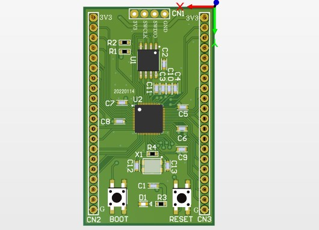
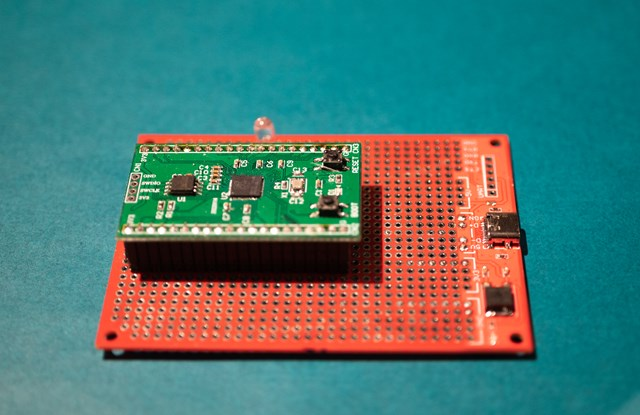

# AN-221 RP2040 SimpleBoard

# ■ 概要
 
RaspberryPi-Picoで使われているRP2040を

ただ使われるだけでなく、自分で使えるようにしたかったので

一から設計して動作確認までしました。

# ■ 仕様

- CPU：RP2040
- ROM：W25Q16JV
- クロック：12MHz

# ■ 特徴

PICOにはResetスイッチがありませんが、使いやすく基板上に載せました。

PICOはUSB端子がついている為、USBはドライバーモードでしか動きませんが、此方はホストモードでも動作させることが出来ます。

# ■ 内容物

- 基板のみ
    - 基板

- 部品セット
    - W25Q16JV x1
    - 水晶12MHz x1
    - 水晶用コンデンサ x2
    - タクトスイッチ x2

- 実装済み
    - 実装済み基板

# ■ 使用例

# ■ 資料

